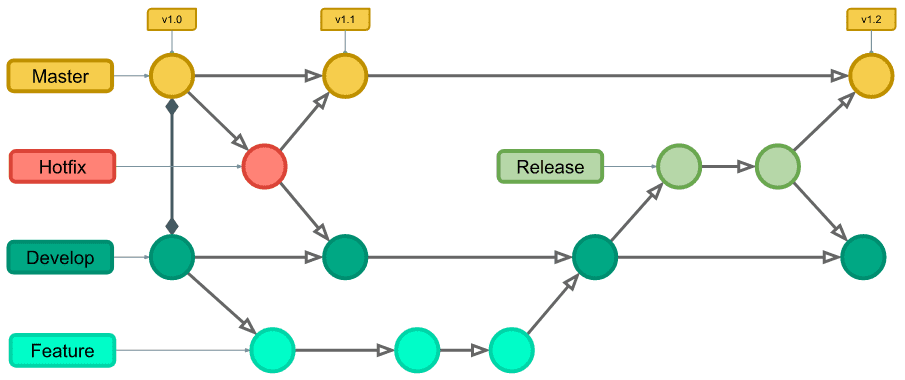

# LIVFIT


## 🤝 LITFIT

> Media Pipe 기반 사용자 운동 자세 측정 서비스</br>
> 거북목 측정 서비스 </br>
> 거북목 점수에 대한 랭킹 제공

## 🎯 프로젝트의 목적(Purpose)

> 멋쟁이자사처럼 12기 중앙해커톤 주제 </br>
> "IT 기술을 활용하여 현대인의 건강 (wellness) 문제를 해결할 수 있는 웹 서비스를 개발하시오."</br>
> 운동을 단순히 기록 하는게 아닌 측정을 할 수 있으면 어떨까? 에서 시작된 프로젝트</br>
>
> 프로젝트 기간 : 2024/07/26 ~ 2024/08/07

## 🤩 팀원들(Team Members)

|                                      Lead                                       |                                     Design                                      |                                    Developer                                    |                                    Developer                                    |                                    Developer                                     |
|:-------------------------------------------------------------------------------:|:-------------------------------------------------------------------------------:|:-------------------------------------------------------------------------------:|:-------------------------------------------------------------------------------:|:--------------------------------------------------------------------------------:|
|                        [황현진](https://github.com/nowjiin)                        |                       [김민지]()                        |                       [하경림](https://github.com/april0114)                       |                         [서현은](https://github.com/hyuneu-n)                          |                        [박태경](https://github.com/tgyeongt)                        |
|  |  |  |  |  |

## 🛠️ 기술 스택(Tech)

### FE


### BE


### Infra


### 협업 툴 (Tools)


### 디자인 


## ERD 설계
> 작성중
> 

## API 설계 문서
> 작성중

## Git Flow


# 🎯 Branch Convention & Git Convention

## 🎯 Git Convention

- 🎉 **Start:** Start New Project [:tada]
- ✨ **Feat:** 새로운 기능을 추가 [:sparkles]
- 🐛 **Fix:** 버그 수정 [:bug]
- 🎨 **Design:** CSS 등 사용자 UI 디자인 변경 [:art]
- ♻️ **Refactor:** 코드 리팩토링 [:recycle]
- 🔧 **Settings:** Changing configuration files [:wrench]
- 🗃️ **Comment:** 필요한 주석 추가 및 변경 [:card_file_box]
- ➕ **Dependency/Plugin:** Add a dependency/plugin [:heavy_plus_sign]
- 📝 **Docs:** 문서 수정 [:memo]
- 🔀 **Merge:** Merge branches [:twisted_rightwards_arrows:]
- 🚀 **Deploy:** Deploying stuff [:rocket]
- 🚚 **Rename:** 파일 혹은 폴더명을 수정하거나 옮기는 작업만인 경우 [:truck]
- 🔥 **Remove:** 파일을 삭제하는 작업만 수행한 경우 [:fire]
- ⏪️ **Revert:** 전 버전으로 롤백 [:rewind]

## 🪴 Branch Convention (GitHub Flow)

- `main`: 배포 가능한 브랜치, 항상 배포 가능한 상태를 유지
- `feature/{description}`: 새로운 기능을 개발하는 브랜치
    - 예: `feature/add-login-page`

### Flow

1. `main` 브랜치에서 새로운 브랜치를 생성.
2. 작업을 완료하고 커밋 메시지에 맞게 커밋.
3. Pull Request를 생성 / 팀원들의 리뷰.
4. 리뷰가 완료되면 `main` 브랜치로 병합.
5. 병합 후, 필요시 배포.

**예시**:

```bash
# 새로운 기능 개발
git checkout -b feature/add-login-page

# 작업 완료 후, main 브랜치로 병합
git checkout main
git pull origin main
git merge feature/add-login-page
git push origin main
```

## 🐋 로컬에서 Docker 로 빌드하기 🐋

1. Docker Desktop 실행
2. Build 하기 전 spotless 적용 ```./gradlew spotlessApply```
3. 정해진 컨벤션을 지키고 있는지 검사 (spotelesscheck) ```./gradlew spotlessCheck```
4. spring boot build ```./gradlew build```
5. Docker Desktop 실행중 인지 확인 ```docker info```
6. Docker로 빌드하기 ```docker build -t "본인 dockerhub repo 이름"/livfit . ```
7. Docker Hub login(IDE terminal에서 실행) ```docker login```
8. Docker Image Tag ```docker tag "본인 dockerhub repo 이름"/livfit "본인 dockerhub repo 이름"/livfit:latest```
9. Docker Image Push ```docker push "본인 dockerhub repo 이름"/livfit:latest```

### 🐋 Docker 실행중인 컨테이너 중지하기 🐋
1. 실행 중인 컨테이너 목록 확인 ```docker ps```
2. 컨테이너 중지 실행 중인 컨테이너의 CONTAINER ID를 찾아서 중지. ```docker stop <CONTAINER ID>```
3. 컨테이너의 삭제가 필요할 경우 ```docker rm <CONTAINER ID>```
4. 이미지 삭제가 필요할 경우 ```docker rmi <IMAGE ID or IMAGE NAME>```
